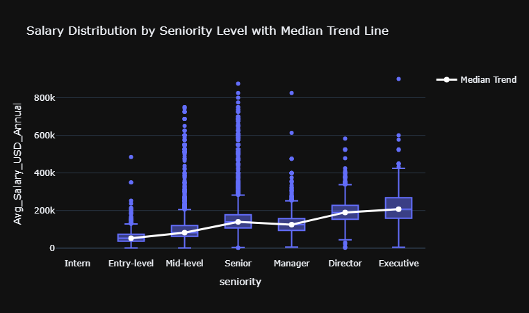
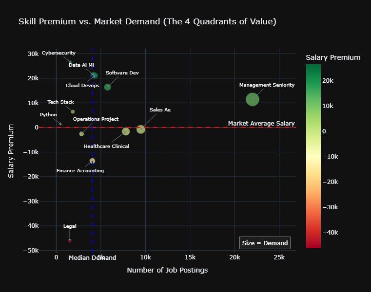
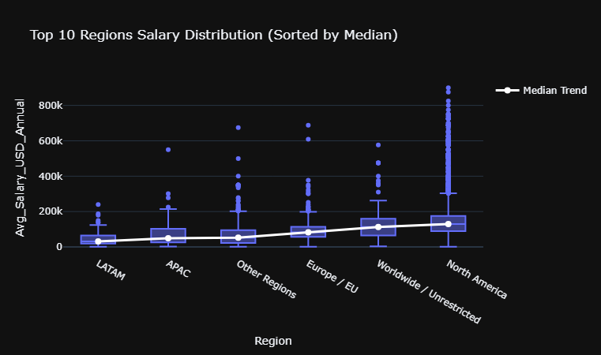

# Remote Jobs Market Analysis 🌍💼

## Overview
This project presents an Exploratory Data Analysis (EDA) of the global remote job market. By analyzing job postings, salaries, locations, and required skills, this analysis provides data-driven insights into hiring trends, compensation structures, and in-demand roles for remote workers worldwide.

## Key Insights & Findings

### 1. Compensation & Seniority 📈
* **The Seniority Ladder:** Salaries scale predictably with experience. However, the largest salary variance and massive outliers (reaching up to $1M+ annually) are found at the **Senior** and **Executive** levels.
* **Employment Type:** **Full-Time** roles absolutely dominate the market, offering both the highest median salaries and the highest salary ceilings compared to part-time or contract roles.

### 2. Geography & Location Restrictions 🌎
* **The North American Advantage:** Jobs restricted to **North America** (specifically US-Only roles) offer significantly higher median and maximum salaries compared to "Worldwide" or Europe-restricted positions.
* **Language Dominance:** **English (en)** is the undisputed primary language of the remote job market, exclusively holding the highest-paying opportunities.
* **Strong Correlations:** There is a near-perfect correlation (0.98) between the geographic "Region" and "Location Restrictions", and a strong correlation (0.52) between location restrictions and the paid currency (predominantly USD).

### 3. Industry Demand vs. Salary Premiums 💡
* **Highest Demand:** The highest volume of remote job postings belongs to **Sales**, **Software Development**, and **Healthcare**.
* **Highest Pay (Medians):** Despite the volume in other sectors, **Product Management**, **Software/Cloud Engineering**, and **Enterprise Sales** boast the highest median salaries.
* **Tech & Niche Salary Premiums:** Roles in **Cybersecurity**, **Data/AI/ML**, and **Cloud/DevOps** command high salary premiums despite having a lower overall demand volume. 
* **The Radiology Outlier:** A fascinating extreme outlier in the dataset is **Radiology**. It has a very low, niche market demand but commands a massive salary premium (exceeding $400k on the scatter plot y-axis).

### 4. Hiring Patterns 📅
* **Best Day to Apply:** Job posting volumes experience a massive spike on **Thursdays** (peaking at over 160k postings on average). Conversely, weekends (especially Sundays) see the lowest hiring activity.

## Visualizations
*(Below are some of the key charts generated during the EDA)*

### Salary Distribution by Seniority

> *Median salaries trend upwards with seniority, with significant outliers in Senior and Executive roles.*

### Salary Premium vs. Demand (Scatter Plot)

> *Notice the extreme outlier for Radiology (Top Left: >$400k premium, low demand) and the high premiums for Cyber/AI/ML tech roles.*

### Global Salary Distribution by Region

> *North American and Unrestricted (Worldwide) roles lead the global compensation charts.*

## Tech Stack
* **Language:** Python
* **Environment:** Jupyter Notebook / VS Code
* **Libraries:** Pandas, Matplotlib, Seaborn (Data manipulation and visualization)

## How to Run This Project
1. Clone the repository: `git clone https://github.com/yourusername/remotejobs_project.git`
2. Install the required dependencies: `pip install -r requirements.txt`
3. Open the `EDA.ipynb` notebook to view the interactive code and charts.